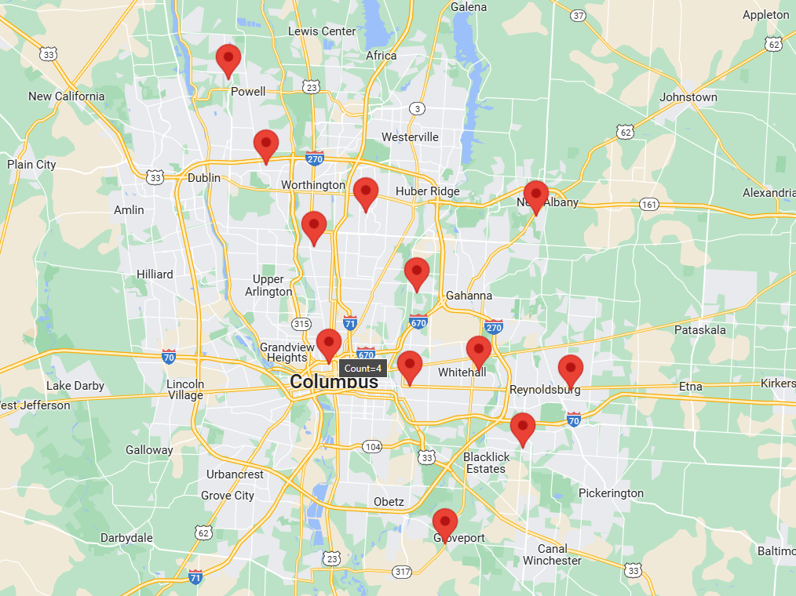

# geoplotter - Geographic Data Mapping Tool

A Python script that generates an interactive HTML map from CSV data containing ZIP codes. The script geocodes ZIP codes to latitude/longitude coordinates and visualizes the data points on a map.

## Prerequisites

- Python 3.x
- Required Python packages:
  - geopy
  - jinja2

## Installation

1. Install required packages:
```bash
pip install geopy jinja2
```

2. Ensure you have the following files in your project directory:
   - `genmap.py` (main script)
   - `data.csv` (input data file)
   - `templates/index.html.j2` (Jinja2 template for map generation)

## Input Data Format

The script expects a CSV file (`data.csv`) with at least the following columns:
- `Name`
- `Primary Zip`

## Usage

1. Place your data in `data.csv` with the required columns
2. Run the script:
```bash
python genmap.py
```
3. The script will generate an `index.html` file containing the interactive map

## How It Works

1. Reads ZIP code data from the CSV file
2. Aggregates data points by ZIP code, keeping count of occurrences
3. Converts ZIP codes to latitude/longitude coordinates using the Nominatim geocoding service
4. Generates an HTML map using a Jinja2 template

## Output

The script generates an `index.html` file that can be opened in any web browser to view the mapped data points.

*NOTE: The sample data.csv contains fake generated data and is not associated with real people.*



## Notes

- Uses the Nominatim geocoding service with a custom user agent
- Handles cases where geocoding fails for certain ZIP codes
- Aggregates multiple entries for the same ZIP code